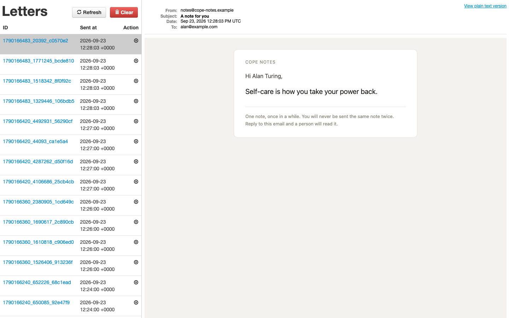
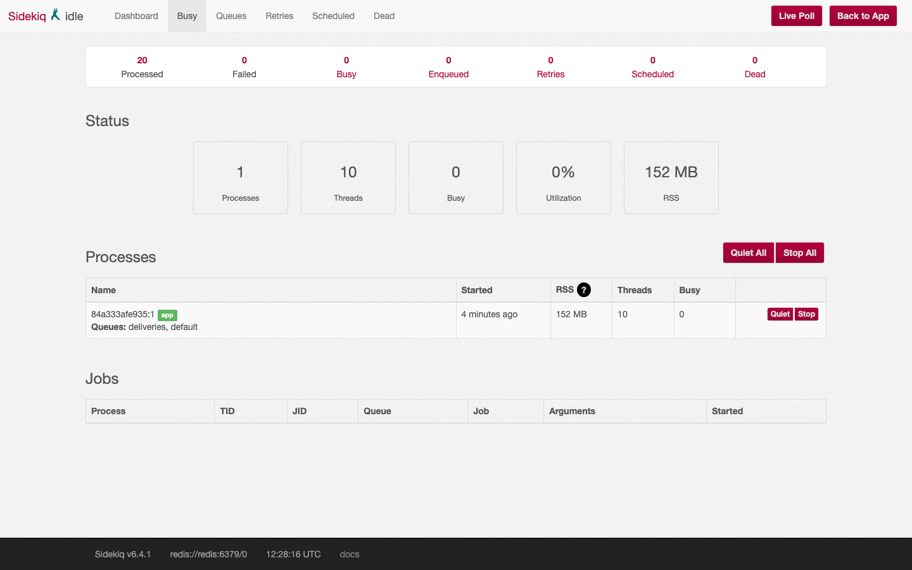
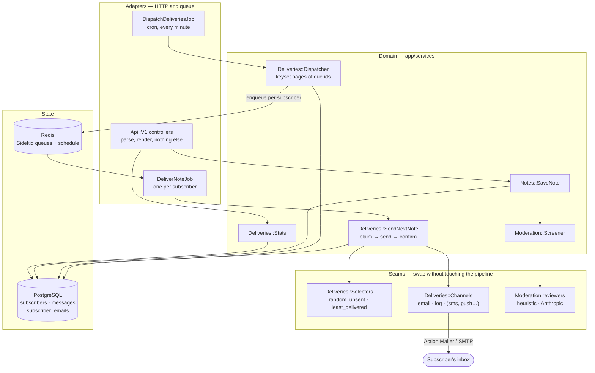
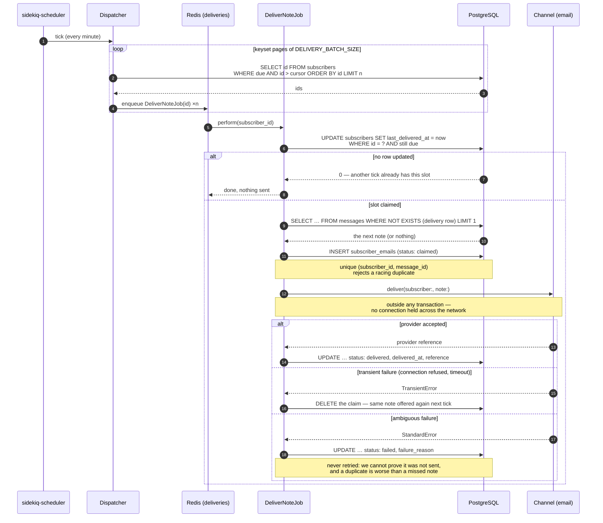

# Cope Notes

A Rails JSON API that emails short supportive notes to subscribers, one note at
a time, on a schedule. Notes are written through the API and screened before
they can be sent; a Sidekiq job wakes once a minute, works out who is due, and
fans the sending out across the worker fleet. The whole product is that pipeline
plus the API that feeds it - there are no application HTML pages.

The interesting problem is not the emailing. It is the delivery guarantee: **no
subscriber is ever sent the same note twice, one subscriber's failure never
touches anybody else's, and what the database says was delivered is what was
actually delivered.**

---

## It working

Full transcripts - boot, worker logs, request/response pairs, the benchmark and
the test run - are in **[docs/captured-output.md](docs/captured-output.md)**.
Two of them here:



*A real send. The Sidekiq worker picked a note this subscriber had not received,
recorded the claim, sent it, and confirmed the row.*



*One worker process, ten threads, subscribed to `deliveries` and `default`.
**Nothing is emailed unless this process is running** - the schedule lives in
Sidekiq, not in the web process.*

A tick, end to end:

```console
$ docker compose logs worker
... INFO: Performing DispatchDeliveriesJob ... from Sidekiq(default)
... INFO: [deliveries] dispatched 3 subscriber(s)
... class=DeliverNoteJob jid=1b7bd351b5561da7b7a25fdd INFO: Delivered mail 6ab3c4e09be9b_144c018865@84a333afe935.mail (56.4ms)
... class=DeliverNoteJob jid=0c0352f169d978b96a2d4b2b INFO: Delivered mail 6ab3c4e09cd47_144d419166@84a333afe935.mail (53.8ms)
... class=DeliverNoteJob jid=ab1c789c77ce557b5642ac1e INFO: Delivered mail 6ab3c4e09cc13_144e81908b@84a333afe935.mail (49.8ms)
```

Three subscribers, three threads, three sends inside 320 ms. One tick later the
dispatcher finds nobody due and does nothing.

---

## Architecture

The shape is a thin adapter layer - HTTP controllers and Sidekiq jobs - wrapped
around a `Deliveries` service namespace that knows nothing about either. Two
registries sit underneath it: a **channel** decides how a note travels, a
**selector** decides which note is chosen. Dependencies point inward; nothing in
`app/services` references a controller, a job, or Sidekiq.



**Why a service layer at all.** The job used to do everything: load every note,
walk every active subscriber, subtract, pick, write the row and make a blocking
SMTP call, all inside one transaction on one thread. Every rule in the product
lived inside a method that could only be exercised by running a job. Splitting
it into *choose a note*, *send it*, *record it* gave each rule a name, a unit
test, and a place for a second implementation to go.

### One delivery, step by step

`claim → send → confirm` is the whole design. The claim is a plain `INSERT` into
`subscriber_emails`, and the unique index on `(subscriber_id, message_id)` is
the lock - two workers racing on the same subscriber cannot both send the same
note, because the loser's insert is simply rejected. No advisory lock, no
`SELECT ... FOR UPDATE`, no extra round trip.



Three properties fall out of that ordering:

* **The send happens outside any transaction.** The previous implementation
  wrapped the SMTP call in one, so a database connection and a row lock were
  held for the whole provider round trip. At a few hundred subscribers that
  alone exhausts the connection pool.
* **The row is written before the send, and confirmed after.** A row that was
  claimed but never confirmed is visible in the `claimed` state instead of being
  indistinguishable from a success. `SubscriberEmail.unconfirmed` is the alert.
* **Failures are classified, not lumped together.** A refused connection means
  the provider never saw the note, so the claim is released and the same note is
  offered again. Anything else is ambiguous, so the claim is kept in the
  `failed` state and the subscriber gets a *different* note next time. For a
  product whose notes are interchangeable, losing one note beats sending a
  duplicate.

---

## Quickstart

```console
$ docker compose up --build
```

That is the whole thing: Postgres, Redis, the API on <http://localhost:8191>,
and the Sidekiq worker. The web container migrates and seeds on the way up, so
there are ten notes and four subscribers waiting.

> **Nothing is emailed unless the `worker` container is running.** The schedule
> lives inside the Sidekiq process (`config/sidekiq.yml`), not in Puma. If you
> start only `web`, the API works perfectly and not a single note is ever sent.
> `docker compose up` starts both.

Give it a minute, then:

| | |
| --- | --- |
| <http://localhost:8191/letter_opener> | every note the worker has sent |
| <http://localhost:8191/sidekiq> | queues, the schedule, retries |
| <http://localhost:8191/api/v1/deliveries/stats> | what the pipeline is doing |
| <http://localhost:8191/up> | liveness, used by the container healthcheck |

To watch a delivery without waiting for the cron:

```console
$ docker compose exec web bundle exec rails deliveries:tick
Enqueued 4 delivery job(s). They run in the Sidekiq process.
```

Ports `8191` (API) and `8192` (Postgres) are set in `docker-compose.yml`; change
them there if they clash.

---

## Configuration

Everything that differs between environments is read from the environment.
Nothing is hardcoded and no secret is committed.

| Variable | Required | Default | What it does |
| --- | --- | --- | --- |
| `DATABASE_HOST` | no | local socket | Postgres host |
| `DATABASE_PORT` | no | `5432` | Postgres port |
| `DATABASE_USER` | no | current user | Postgres user |
| `DATABASE_PASSWORD` | no | none | Postgres password |
| `DATABASE_NAME` | no | `cope_notes_production` | database name, production only |
| `COPE_NOTES_DATABASE_PASSWORD` | no | none | fallback production password |
| `RAILS_MAX_THREADS` | no | `5` | Puma threads and the Active Record pool |
| `REDIS_URL` | no | `redis://127.0.0.1:6379/0` | Sidekiq client and server |
| `SIDEKIQ_CONCURRENCY` | no | `10` | worker threads per Sidekiq process |
| `MAILER_FROM_ADDRESS` | no | `no-reply@cope-notes.example` | `From:` on every note |
| `DELIVERY_INTERVAL_MINUTES` | no | `1` | minimum gap between two notes to one subscriber. `1440` is a note a day |
| `DELIVERY_BATCH_SIZE` | no | `1000` | subscriber ids per keyset page; the dispatcher's memory ceiling |
| `DELIVERY_SPREAD_SECONDS` | no | `0` | scatter a tick's jobs over this many seconds instead of enqueuing them at once |
| `DELIVERY_CHANNEL` | no | `email` | which channel sends. `log` writes to the Rails log instead |
| `NOTE_SELECTION_STRATEGY` | no | `random_unsent` | which note is chosen. `least_delivered` favours newly written notes |
| `ANTHROPIC_API_KEY` | no | unset | enables model-based screening. Unset, the offline reviewer is used |
| `ANTHROPIC_MODEL` | no | `claude-opus-5` | model used for screening |
| `ANTHROPIC_TIMEOUT_SECONDS` | no | `10` | open and read timeout on the screening call |
| `SIDEKIQ_WEB_USERNAME` / `SIDEKIQ_WEB_PASSWORD` | no | unset | when **both** are set, `/sidekiq` sits behind HTTP basic auth |
| `HEALTHCHECK_URL` | no | `http://127.0.0.1:$PORT/up` | what `bin/healthcheck` probes |
| `PORT` | no | `3000` | Puma's port inside the container |

---

## The API

JSON in, JSON out. Parameter wrapping is on, so a body may be sent flat
(`{"text": "…"}`) or nested (`{"message": {"text": "…"}}`). **There is no
authentication** - put this behind a gateway before exposing it.

### Notes

| Method | Path | Body | Response |
| --- | --- | --- | --- |
| `GET` | `/api/v1/messages` | – | `200`, every note with its recipients. `?review_status=flagged` filters |
| `GET` | `/api/v1/messages/:id` | – | `200`, or `404` |
| `POST` | `/api/v1/messages` | `{"text": "…"}` | `201` with the screening verdict, or `422` |
| `PATCH` | `/api/v1/messages/:id` | `{"text": "…"}` | `200`, re-screened if the text changed, or `422` |
| `DELETE` | `/api/v1/messages/:id` | – | `204`, or `404` |

`text` is required, 500 characters maximum. Every write runs through
`Moderation::Screener` and stamps `review_status`:

```console
$ curl -s -X POST http://localhost:8191/api/v1/messages -H 'Content-Type: application/json' \
       -d '{"message":{"text":"If it is not working, stop taking your medication for a week."}}'
HTTP/1.1 201
{
    "id": 13,
    "text": "If it is not working, stop taking your medication for a week.",
    "review_status": "rejected",
    "deliveries_count": 0,
    "subscribers": []
}
```

`approved` and `flagged` notes are deliverable; `rejected` ones are excluded
from selection for good. `flagged` is the editor's queue, not a block.

### Subscribers

| Method | Path | Body | Response |
| --- | --- | --- | --- |
| `GET` | `/api/v1/subscribers` | – | `200`, each with the notes they have received |
| `GET` | `/api/v1/subscribers/:id` | – | `200`, or `404` |
| `POST` | `/api/v1/subscribers` | `{"email": "…", "name": "…"}` | `201`, or `422` |
| `PATCH` | `/api/v1/subscribers/:id` | – | `200` - **toggles** `is_active`; the body is ignored |
| `DELETE` | `/api/v1/subscribers/:id` | – | `204`, or `404` |

Addresses are lower-cased and trimmed before the uniqueness check, so
`Robin@Example.COM` cannot subscribe alongside `robin@example.com`. `name` and
`email` are 50 characters each. Deleting a subscriber deletes their delivery
records.

### Operations

| Method | Path | Response |
| --- | --- | --- |
| `GET` | `/api/v1/deliveries/stats` | counts of subscribers, notes and deliveries, plus the live channel, strategy and interval |
| `GET` | `/up` | `200 ok` |

A Postman collection for the CRUD endpoints is in `postman/`.

---

## Development

Requires Ruby 3.0.2 (see `.ruby-version`), PostgreSQL and Redis.

```console
$ bundle install
$ bin/rails db:setup                 # create, migrate, seed
$ bin/rails s                        # API on :3000
$ bundle exec sidekiq -C config/sidekiq.yml    # ← without this, nothing is sent
```

### Tests

```console
$ bin/rails db:test:prepare
$ bundle exec rspec
```

or, with no Ruby toolchain on the host, inside the image:

```console
$ docker compose run --rm -e RAILS_ENV=test web bundle exec rspec
143 examples, 0 failures
```

No test makes a network call. The Anthropic reviewer's specs stub `Net::HTTP`
outright, and with no API key configured the screener never reaches for it at
all.

### Linting

RuboCop (with `rubocop-rails` and `rubocop-rspec`) is configured in
`.rubocop.yml` and runs from its own bundle, so lint tooling never enters the
application's dependency graph and a RuboCop upgrade can never move a runtime
gem:

```console
$ bin/lint          # check — installs the lint bundle on first run
$ bin/lint -A       # autocorrect
```

### Useful tasks

```console
$ bin/rails deliveries:tick                            # run the dispatcher now
$ bin/rails deliveries:stats                           # the stats endpoint, in a terminal
$ SUBSCRIBER_ID=1 bin/rails deliveries:deliver         # send one note synchronously
$ bin/rails "deliveries:benchmark[10000,200,60]"       # the numbers quoted below
```

---

## Project structure

```
app/
  controllers/api/v1/    HTTP adapters. Parse params, call a service, render.
    deliveries_controller.rb   GET /deliveries/stats
  jobs/
    dispatch_deliveries_job.rb one per tick — fans out, holds nothing
    deliver_note_job.rb        one per subscriber — the unit of failure isolation
  models/
    subscriber.rb              the `due` scope and the atomic slot claim
    message.rb                 `deliverable` and the `unsent_to` anti-join
    subscriber_email.rb        the delivery record; claimed → delivered/failed
  services/
    deliveries.rb              env-backed configuration for the pipeline
    deliveries/
      dispatcher.rb            keyset pagination over the due set
      send_next_note.rb        claim → send → confirm, and failure classification
      selectors/               which note: random_unsent, least_delivered
      channels/                how it travels: email, log
      stats.rb                 aggregate-only operational snapshot
      benchmark.rb             reproduces the measurements below
    moderation/
      screener.rb              fails open, falls back to the offline reviewer
      heuristic_reviewer.rb    deterministic, offline, no key needed
      anthropic_reviewer.rb    Claude via the Messages API
    notes/save_note.rb         create/update a note, re-screening changed text
  mailers/, views/message_mailer/   the one thing a subscriber ever sees
config/
  sidekiq.yml            queue weights and the once-a-minute cron
  initializers/deliveries.rb   registers the channels and selectors
db/migrate/20260923090000_add_delivery_tracking_and_indexes.rb
spec/                    143 examples: models, services, jobs, mailer, controllers
docs/captured-output.md  real transcripts of all of the above
```

---

## Design notes

### Scalability: what actually breaks, and when

The original job was a single thread that loaded every note into a hash, walked
every active subscriber with `includes(:messages)`, subtracted one set from the
other in Ruby, and made a blocking SMTP call for each. Two separate problems
live in that sentence: the work grows with the whole table, and it is serial.

`rails "deliveries:benchmark[10000,200,60]"` measures both against a real
Postgres - 10,000 subscribers, 200 notes, 600,000 existing delivery rows:

| | before | after | |
| --- | ---: | ---: | --- |
| Find who is due (one page) | 1,439 ms | **4.1 ms** | `≈350×` |
| …objects allocated | 1,330,951 | **1,404** | `≈950×` |
| One tick's work for 1,000 subscribers | 1,950 ms | **1,235 ms** | |
| …objects allocated | 1,400,601 | **391,484** | `≈3.6×` |
| Choose one subscriber's next note | – | **0.91 ms** | 9 buffer hits |

Three changes produced that:

1. **A partial index that covers the due set exactly.**
   `index_subscribers_due_for_delivery` is `(last_delivered_at, id) WHERE
   is_active`. Unsubscribed rows are not in the index at all, the timestamp
   gives the range scan, and the trailing `id` makes the dispatcher's walk
   index-only.
2. **Keyset pagination, not `OFFSET`.** `id > cursor ORDER BY id LIMIT n`
   costs the same on page one and page ten thousand, and memory is capped at
   `DELIVERY_BATCH_SIZE` ids however large the table gets.
3. **`NOT EXISTS` instead of set subtraction in Ruby.** Postgres plans it as a
   `Hash Right Anti Join` straight off the unique index on
   `(subscriber_id, message_id)` - 9 shared buffer hits, no heap fetches, and
   nothing about it grows with how many notes that subscriber has already had.

The other half is parallelism. Dispatch and delivery are now separate jobs on
separate queues, so a tick enqueues and returns while the sends run across every
thread in the fleet.

**Capacity, reasoned from those measurements** and a 150 ms SMTP round trip:

* *Before*: ~152 ms per subscriber, serial, in one job. A once-a-minute schedule
  overruns at roughly **400 subscribers**, and from then on each tick falls
  further behind the last.
* *After*: the dispatcher's own work for 10,000 subscribers is ten keyset pages,
  about **41 ms**. Sending is ~151 ms per subscriber spread across the pool:
  **≈3,970 subscribers/minute at the default 10 threads, ≈9,900 at 25.** Adding
  worker containers moves that number linearly; the dispatcher does not care.
* *At 1M subscribers* a once-a-minute note is not an engineering problem, it is
  a product one - 151,000 thread-seconds of sending per minute is ~2,500 threads
  and 16,000 messages/second, which no SMTP provider will accept. At a realistic
  cadence (`DELIVERY_INTERVAL_MINUTES=1440`) the due set is ~695 subscribers in
  any given minute - under a single keyset page - and the sustained send work is
  about **1.8 threads**. The pipeline is then bounded by the provider's rate
  limit, not by this application.

**The thundering herd is real and only partly solved.** A bulk import leaves
every row with `last_delivered_at` NULL, so the first tick afterwards finds all
of them due at once and enqueues one job each - a million jobs into Redis in one
tick, roughly 200 MB of queue. `DELIVERY_SPREAD_SECONDS` scatters *execution*
over a window, which protects the SMTP provider and flattens the load profile,
but the jobs are still all enqueued at once. A dispatcher that stops after
`DELIVERY_MAX_PER_TICK` and resumes from its cursor next minute is the honest
fix, and it is not implemented.

Other bounded costs, deliberately: `/api/v1/deliveries/stats` is aggregates
only, never a collection; `messages.deliveries_count` is a counter cache so
`least_delivered` stays a single indexed `LIMIT 1` rather than an aggregate over
the join table; and `index_subscriber_emails_needing_attention` is partial on
`status <> 'delivered'`, because delivered rows are the overwhelming majority
and nothing ever queries them by status.

**What is still unaddressed.** `GET /api/v1/messages` and
`GET /api/v1/subscribers` are unpaginated and eager-load the join in both
directions; they are fine for an editorial tool over a few hundred notes and
would need cursor pagination before anything else. Delivery rows grow at
subscribers × notes and nothing archives them.

### Extensibility: one seam, used twice

`Deliveries::Channels` is a registry keyed by name. A channel is any object with
`deliver(subscriber:, note:) → reference`, and adding SMS means writing that
class and one line in `config/initializers/deliveries.rb`:

```ruby
Deliveries::Channels.register(:sms, Deliveries::Channels::Sms)
```

Nothing above it changes - not the job, not the selection strategy, not
`SendNextNote`. `DELIVERY_CHANNEL` picks the one in use. The seam is honest
because it already has two real implementations: `email`, and `log`, which is
what the benchmark uses to exercise the dispatcher without pointing a load test
at a real SMTP server.

The same shape is used a second time for note selection.
`Deliveries::Selectors` is the place an engagement-driven or personalised choice
goes, and `least_delivered` is there to prove the seam holds: it favours notes
the fewest subscribers have seen, so a newly written note enters circulation
immediately instead of waiting for a random draw.

The channel contract is also where the transient/ambiguous distinction lives.
`Channels::Email` lists the errors that mean the provider never accepted the
note; everything else is ambiguous by default. A new channel classifies its own
failures and the delivery service's guarantee is unchanged.

### Screening, and why it fails open

Cope Notes go to people who are having a hard time. A note that is dismissive,
that gives medication advice, or that could read as encouragement to self-harm
must never be sent, so screening runs on every write and the delivery path only
ever selects from notes that are not `rejected`.

There are two reviewers. `HeuristicReviewer` is deterministic, offline and
deliberately narrow - it catches only what is unambiguous in plain text and
approves everything else. `AnthropicReviewer` sends the note to Claude and is
used **only** when `ANTHROPIC_API_KEY` is set. The app is fully functional with
no key, and the entire suite passes with no network.

`Screener` fails open: if the configured reviewer raises, the offline reviewer
answers instead, and if that somehow fails too the note is approved. Blocking an
editor from writing because a third-party API is rate-limited would be the worse
outcome, and `flagged` exists so nothing slips past unnoticed. The API call is
plain `Net::HTTP` rather than the official gem because that gem needs Ruby ≥ 3.2
and this application is pinned to Ruby 3.0.2; the `Verdict` contract is what the rest of
the app depends on, so moving to the SDK later is a change to one method body.

### Smaller decisions

* **`last_delivered_at` is a scheduling cursor, not a delivery record.**
  `Subscriber.claim_delivery_slot` moves it with a single conditional `UPDATE`
  before the send, so two overlapping ticks cannot both send - Postgres
  serialises the statements and the second matches no rows. The truth about what
  was sent stays in `subscriber_emails`, which is written after.
* **The dispatcher and the deliveries have separate queues**, weighted 1:5, so a
  backlog of sends can never starve the tick that creates them.
* **`letter_opener_web` is mounted only in development**, and a production image
  (`--build-arg BUNDLE_WITHOUT="development test"`) does not contain the gem at
  all. The mount is guarded by `if Rails.env.development?` for exactly that
  reason.
* **The compose worker and web share a volume at `tmp/letter_opener`.** The
  worker sends; the web process serves the viewer. Without the shared volume the
  viewer is always empty, which looks like "nothing is being sent".
* **`Gemfile.lock` is not modified by the Docker build.** It is resolved on
  macOS and lists only the darwin platform, so the `gems` stage runs
  `bundle lock --add-platform` inside the image. Nobody has to run bundler on a
  machine they do not develop on in order to build a container.

---

## Limitations

* **No authentication, anywhere.** Any caller can create, edit and delete notes
  and subscribers. `/sidekiq` is behind basic auth only if you set both
  credentials. This belongs behind a gateway.
* **No unsubscribe link in the email.** `PATCH /api/v1/subscribers/:id` toggles
  the flag, but nothing in the note itself lets a recipient act on it. For a
  product that emails people unprompted this is the first thing to fix, and it
  is a legal requirement in most jurisdictions.
* **Index and subscriber listings are unpaginated**, and eager-load the delivery
  join in both directions.
* **A dispatcher tick enqueues every due subscriber**, with no per-tick cap - see
  the thundering-herd note above.
* **A subscriber who has received every note simply stops**, silently. Nothing
  alerts an editor that the pool is exhausted; `deliveries/stats` reports the
  count and that is all.
* **An ambiguous send failure loses that note for that subscriber permanently.**
  That is the deliberate trade - no duplicates - but it means a provider outage
  that returns 500s quietly burns one note per affected subscriber. The rows are
  visible as `status: failed`; nothing reconciles them.
* **Webpacker, Turbolinks, Sass and Action Cable are Rails-generator leftovers**,
  as are the unused `spring` and `whenever` gems. The API uses none of them.
  Pruning them is a dependency change rather than a code one, and this pass kept
  `Gemfile.lock` byte-identical to the set the suite and the image were verified
  against.
* **Notes are plain text.** No localisation, no personalisation beyond the
  greeting, no send-time optimisation.
